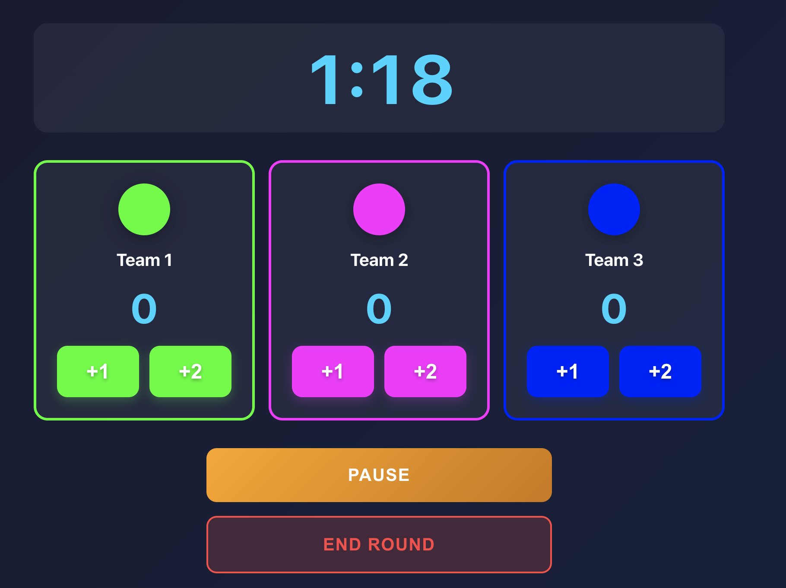

# ThreeZone

A mobile sports scoring app for three-team timed rounds, built with React + TypeScript and packaged for Android via Capacitor.



## Features

- **Three-team scoring** — track points for up to 3 teams simultaneously
- **Configurable round duration** — choose between 1–5 minutes per round
- **Countdown timer** — with audio alert at 10 seconds remaining
- **Pause / Resume** — pause the countdown mid-round and continue
- **End round early** — stop a round prematurely with a confirmation prompt
- **Round history** — view scores from all previous rounds after each round ends

## Getting Started

### Prerequisites

- Node.js 18+
- Java 21 (for Android builds)
- Android SDK

### Install dependencies

```bash
npm install
```

### Run in browser

```bash
npm run dev
```

### Build and deploy to Android

```bash
npm run build
npx cap sync android
cd android && ./gradlew assembleDebug
```

The debug APK will be at `android/app/build/outputs/apk/debug/app-debug.apk`.
